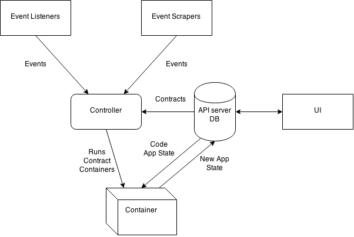

# Overview

Smart contracts are executable code. This code is executed when triggered by the arrival of events, which causes contracts to change state, and send new events on their own.

The system has the following characteristics:

- Events happen at any time, asynchronously. The system must be able to handle these events, and schedule and manage execution of, potentially a great many, contracts based on their arrival. This mandates the use of a message queue.
- Contracts contain Turing-complete executable code. This places strict security restrictions on the system. Uncontrolled side-effects of the code are not allowed. For this reason, contract code is executed in a sandbox, where it cannot interact with the outside world other than via provided APIs.

# Data Flow

Events come in through event listeners, which provide an API, and get called when an event happens, or through event scrapers, which actively poll other services for information that constitues an event. Events, once generated, flow into a controller. Controllers determine which contracts are waiting for an event, and schedule execution of the code of those contracts. To execute a contract, a container is spun up for the contract, and instructed to run its code.

In addition to the code, a contract also contains the application state for contract. The application state for a contract is an immutable piece of data that fully describes the state of the execution of a contract at a point in time. When the application state of a contract changes, a new application state is recorded for the contract with the time of change of the state.

The container contains a language-specific runtime system that loads the code and the application state for the contract. The application state is used to initialize the contract to the exact point it reached after handling the previous event. At that point the event is fed to the code, and the code's handling of the event is executed. This will cause the application state of the code to change. It may also cause new events to flow into the system. The new application state after handling of the event is complete, is stored in the system.

# Message queueing

To engineer the asynchronous event flow and corresponding contract execution, it's best to decouple the various functionalities, as they have very different characterists, both in terms of scaling, security, ease of development and performance. A message queuing system looks an appropriate way of making that decoupling happen. 

Various event listeners and scrapers produce events on the queue when they are found to have happened. By agreeing on a common event format, new event producers do not need to be aware of other components in the system and can be developed fairly easily. Controller components listen for events, and, based on their knowledge of the contracts in the system and which events those are sensitive for, can schedule execution of these contracts for the incoming events.

Since contract execution has different scaling and security requirements, the controllers issue execution requests on the message bus. These requests are picked up by contract execution components. The executors can be scaled based on the number of contracts in the system. 

Contract execution, in turn, results in app state being updated, and, potentially, new events being created on the queue. These may, for example, be notification events. Parties to a contract will need to be updated when the state of their contracts change, and, again, this is best done asynchronously, by a separate component.

