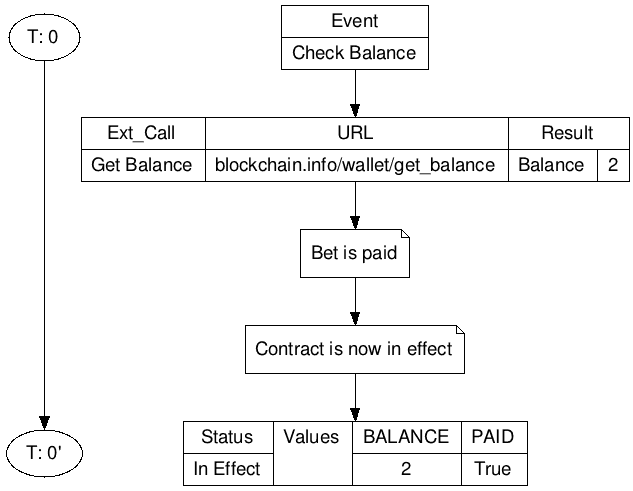
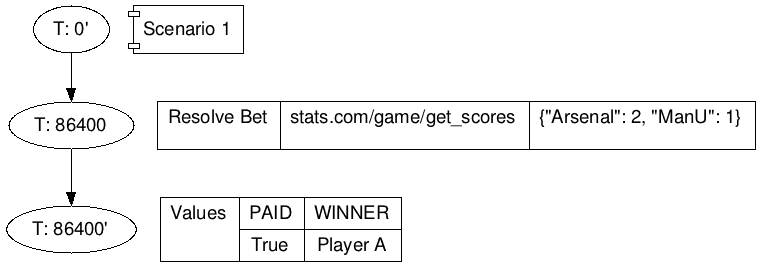
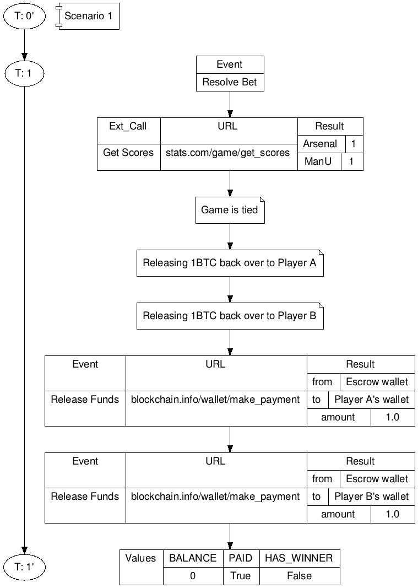

# Schedule B - Simulation Report Example

**Contract**: Ars_v_Man_2015_05_16

**Description**: A friendly bet between friends; Sam ("Player A") is betting on Arsenal, Henry ("Player B") is betting on ManU.

**Scenario List**:

1. Bet goes into effect
1. Game ends--team wins
1. Game ends--score tied
1. Bet not paid by a party
1. Game delayed
1. Game forfeited
1. 3rd party data supplier error--incorrect data
1. 3rd party data supplier error--invalid data
1. Bet underpaid
1. Bet overpaid

## Scenario 1: Bet goes into effect

This is a partial scenario examining the normal course of dealings to bring the contract into effect.

### Preconditions

None

### Events

Time Step|Event|Parameters|External Calls|URL|Results
---|---|---|---|---|---
0|Check Balance||Balance from Blockchain|`blockchain.info/wallet/get_balance`|`{"balance":2}`

### Diagram

## Scenario 2: Game ends--team wins

This is the most expected scenarion--happy path.

### Preconditions

1. Scenario 1

### Events

Time Step|Event|Parameters|External Calls|URL|Results
---|---|---|---|---|---
1|Resolve Bet|`{"teams": ["Arsenal", "Manchester United"], "game_date": "20150515"]`|Get Scores|`stats.com/game/get_scores`|`{"Arsenal": 2, "ManU": 1}`

### Diagram

## Scenario 3: Game ends--score tied

The game is tied.

### Preconditions

1. Scenario 1

### Events

Time Step|Event|Parameters|External Calls|URL|Results
---|---|---|---|---|---
1|Resolve Bet|`{"teams": ["Arsenal", "Manchester United"], "game_date": "20150515"]`|Get Scores|`stats.com/game/get_scores`|`{"Arsenal": 1, "ManU": 1}`

### Diagram

